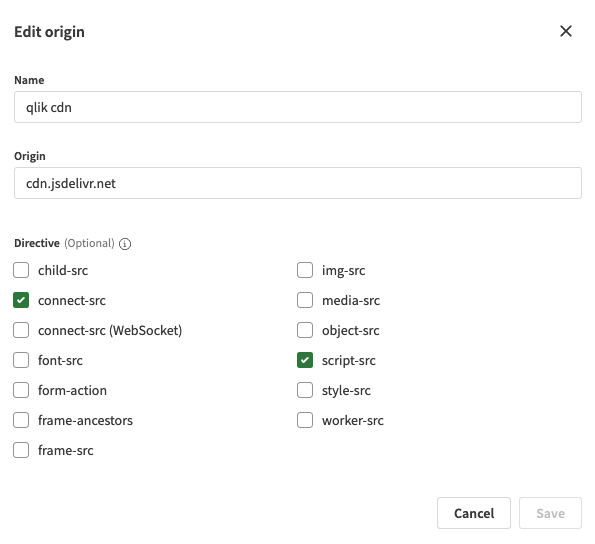

# Answers for Sense

This extension allows you to embed a Qlik Answers assistant in your Qlik Sense app.

## Installation
1. Download the extension from here: https://github.com/rileymd88/answers-for-sense/releases/download/0.1.2/answers-for-sense-ext.zip
2. Upload the extension to Qlik Cloud
3. Add https://cdn.jsdelivr.net to your Content Security Policy with the `script-src` and `connect-src` directives

   

## Demo

## Changelog

### v0.1.2
- Added theme option

### v0.1.1
- Assistant dropdown will now be populated with all assistants in the Qlik Answers instance (before it was limited to 20)

### v0.1.0
- First release
- Embed a Qlik Answers assistant in your Qlik Sense app
- Select the assistant from a dropdown or use a formula to provide the assistant ID
- Open the assistant in a dialog
- Background styling