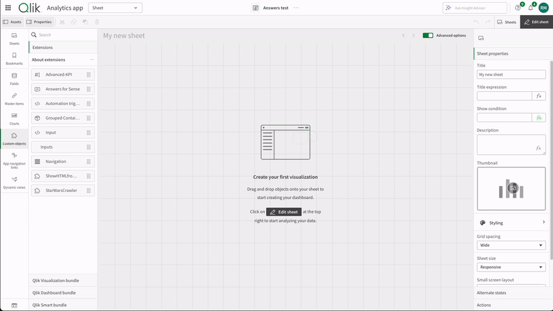

# Answers for Sense

This extension allows you to embed a Qlik Answers assistant in your Qlik Sense app.

## Installation
1. Download the extension from here: https://github.com/rileymd88/answers-for-sense/releases/download/0.1.3/answers-for-sense-ext.zip
2. Upload the extension to Qlik Cloud

## Demo

## CSS Documentation
The table below lists the available class names and their respective descriptions to assist with CSS customization.

| Class Name | Description |
|------------|-------------|
| `answers-for-sense-container` | Main container for the entire extension. |
| `answers-for-sense-empty-state` | Container displayed when no assistant is selected. |
| `answers-for-sense-icon-wrapper` | Wrapper for the icon button used to open the dialog. |
| `answers-for-sense-icon-button` | The icon button used to open the dialog. |
| `answers-for-sense-icon` | The icon itself within the icon button. |
| `answers-for-sense-dialog` | The main dialog component. |
| `answers-for-sense-dialog-title` | The title section of the dialog. |
| `answers-for-sense-close-button` | The close button in the dialog. |
| `answers-for-sense-dialog-content` | The content section of the dialog. |
| `answers-for-sense-embed-container` | Container for the embedded Qlik Answers assistant. |
| `answers-for-sense-edit-overlay` | Overlay displayed in edit mode. |

## Changelog

### v0.1.3
- Removed the need to add a content security policy to use the extension
- Moved styling options to the presentation settings
- Added ability to select from different icons
- Added icon position option
- Added icon color option
- Added icon size option
- Added css classes to allow for easier css customization

### v0.1.2
- Added theme option

### v0.1.1
- Assistant dropdown will now be populated with all assistants in the Qlik Answers instance (before it was limited to 20)

### v0.1.0
- First release
- Embed a Qlik Answers assistant in your Qlik Sense app
- Select the assistant from a dropdown or use a formula to provide the assistant ID
- Open the assistant in a dialog
- Background styling